# [F2] Data Crawling — Thiết kế sơ bộ

> Task gốc: Jira `AI_ECOM-149` — "[F2] Data Crawling — Thu thập dữ liệu từ các nguồn"
> Nghiệp vụ tham chiếu: `LevelUp_SRS_Research.md` (Product R&D Automation, Phase 1: Product Research)
> Trạng thái: **Đang triển khai trên base có sẵn** — không còn xây từ đầu, xem mục 0.
> Stack: **Python / FastAPI** — lý do: Google Ads API chỉ có client library chính thức cho Python/Java/.NET/PHP/Ruby/Perl, không có Node.
> Queue: **arq + Redis** (không phải Celery như bản nháp đầu) — đổi để khớp với `levelup_ai` (AI service Python thật của LevelUp, cũng dùng arq), tránh 2 service Python trong org dùng 2 kiểu queue khác nhau.

---

## 0. Base code hiện có

Không code từ đầu — công ty giao lại 1 base sẵn có do đồng nghiệp viết, đang dùng làm nền để phát triển tiếp F2.

- **Repo gốc:** `git@github.com:hiepnguyen2000hn/crawl-ecomerce-.git` (tài khoản GitHub cá nhân của đồng nghiệp). Đã clone về `level-up/crawl-ecomerce-` (sibling với `levelup_be`, `levelup_ai`).
- **Cần làm sớm:** chuyển repo này sang org công ty (`relipasoft`, cùng chỗ với `levelup_be`/`levelup_ai`) để không phụ thuộc tài khoản cá nhân — xem mục "Việc cần làm ngay".
- **Đã có sẵn trong base**, dùng được luôn:
  - FastAPI + SQLAlchemy (async) + Postgres, `ApiAuditLog` (JSONB request/response) đóng đúng vai trò `raw_crawl_results` đã đề xuất ở bản thiết kế đầu.
  - `ProviderKey`/`Proxy` model — key rotation + proxy rotation có cooldown, đúng pattern cần cho scraping.
  - **F2.2 (Ads Spy)** — đã có, qua **Apify** actor scrape Facebook Ads Library (`app/services/apify_client.py`).
  - **F2.1 (một phần)** — Google Trends qua **SerpAPI** (`app/providers/google_trends_direct.py`) làm nguồn search-demand thay thế, không cần chờ Google Ads Developer Token (đang xin, có thể mất vài tuần).
  - **F2.4 (một phần)** — AI Price Extractor: fetch HTML 1 URL (`app/services/web_fetcher.py`) rồi dùng LLM qua OpenRouter (`app/services/openrouter_client.py`) trích giá sản phẩm — đúng tinh thần "AI Price Extractor" ở Bước 3.1 SRS.
- **Đã sửa (xem mục 3b):** endpoint Facebook Ads trước đây block HTTP request tới 300s (poll Apify ngay trong request handler) — đã chuyển sang chạy nền qua arq + `GET /api/v1/ads/jobs/{job_id}` để poll kết quả.
- **Chưa có, cần code tiếp:** F2.3 (Amazon/AliExpress/Bol.com), F2.5 (1688/Taobao/Alibaba) — cả 2 đều cần Playwright vì base hiện tại chưa có browser automation nào (chỉ fetch HTML tĩnh).

---

## 1. Phạm vi

F2 chỉ chịu trách nhiệm **crawl và lưu dữ liệu thô** từ các nguồn bên ngoài, phục vụ 5 bước research trong SRS:

| Sub-task | Nguồn dữ liệu | Loại truy cập |
|---|---|---|
| F2.1 — Keyword & Market Data | Google Ads API (`KeywordPlanIdeaService`), Meta Delivery Estimate API | API chính thức |
| F2.2 — Ads Spy Data | Meta Ads Library, Pipiads/PPspy | API chính thức (Ads Library có API) + API trả phí bên thứ 3 |
| F2.3 — E-commerce Product Data | Amazon, AliExpress, Bol.com | Không có API công khai đầy đủ → scraping |
| F2.4 — Competitor Price | Landing page đối thủ, store link ecom | Scraping |
| F2.5 — Supplier Data | 1688, Taobao, Alibaba | Không có API → scraping |

**Không thuộc phạm vi F2** (để tránh scope creep): AI filter/matching/sentiment, tính sub-score (S1–S4), UI hiển thị. F2 chỉ đưa dữ liệu thô/đã chuẩn hóa nhẹ vào DB cho các module đó dùng.

---

## 2. Giả định & câu hỏi mở

1. ~~**Vị trí code**~~ — **Đã chốt:** service/repo riêng (mục 0), không phải module trong `levelup_be`. Còn treo: chuyển quyền sở hữu repo sang org `relipasoft` (xem mục 0).
2. **API access:** Chưa rõ đã có Google Ads Developer Token / Meta Marketing API app access hay chưa. **Cần xin ngay** vì thời gian duyệt có thể mất vài ngày đến vài tuần. Trong lúc chờ, F2.1 đã có SerpAPI Google Trends làm nguồn tạm (mục 0).
3. **Nguồn nào tự scrape, nguồn nào mua data qua bên thứ 3:** Base đã chọn Apify cho Facebook Ads (F2.2) và SerpAPI cho Google Trends (F2.1) — đúng hướng "ưu tiên mua qua bên thứ 3". Cần xác nhận ngân sách các gói trả phí này (Apify, SerpAPI, OpenRouter) đủ dùng khi tăng volume.
4. **Pháp lý/ToS:** Scrape trực tiếp Amazon, Alibaba, 1688 (F2.3, F2.5 — chưa code) đều vi phạm Điều khoản dịch vụ của các nền tảng này. Cần Lead/Legal biết và chấp nhận rủi ro (IP bị block, tài khoản bị khóa) trước khi code 2 phần này.
5. **Giao tiếp Crawler ↔ AI Service:** Chưa rõ có Orchestrator đứng giữa gọi cả 2, hay AI Service (`levelup_ai` hoặc 1 AI service riêng cho AI_ECOM) tự gọi thẳng sang Crawler Service. Đề xuất MVP: REST thuần — AI Service là 1 client bình thường của Crawler Service, gọi `POST /api/v1/ads/search` để enqueue và `GET /api/v1/ads/jobs/{job_id}` để poll, hoặc query thẳng bảng kết quả (`GET /api/v1/ads`) khi cần đọc hàng loạt để chạy matching. Khác với `levelup_ai` (stateless, nhận payload qua HTTP rồi callback ngược) — Crawler Service **có DB, chủ động lưu**, nên mô hình đúng là AI Service poll/query, không phải Crawler Service callback ngược.

---

## 3. Kiến trúc tổng quan

Ý tưởng cốt lõi: **1 khung crawler dùng chung**, mỗi nguồn dữ liệu (F2.1–F2.5) chỉ là một "connector" cắm vào khung đó — tránh viết lại retry/rate-limit/logging 5 lần.

```mermaid
flowchart LR
    Trigger[Orchestrator / AI Service\ngọi crawl] --> API[FastAPI route]
    API --> Queue[(Redis\narq broker + JobStore)]
    Queue --> Worker[arq worker]

    subgraph Worker2[Service layer — 1 module / nguồn]
        direction TB
        C1[google_trends_direct.py\nSerpAPI — F2.1 tạm thời]
        C2[apify_client.py\nApify Facebook Ads — F2.2]
        C3[web_fetcher.py + openrouter_client.py\nAI Price Extractor — F2.4]
        C4["ecom scraper (chưa code)\nPlaywright — F2.3"]
        C5["supplier scraper (chưa code)\nPlaywright — F2.5"]
    end

    Worker --> Worker2
    Worker2 --> Raw[(api_audit_logs\nJSONB request/response, luôn lưu)]
    Raw --> Domain[(Bảng nghiệp vụ\ngoogle_trends_results\nfacebook_ads_results\nai_analysis_results ...)]
```



### Nguyên tắc thiết kế

- **Chạy qua queue, không đồng bộ trong HTTP request.** Áp dụng cho mọi call có thể mất >5-10s (Apify actor run tới 300s). Dùng **arq + Redis**: router chỉ `enqueue_job()` rồi trả `202 {job_id}` ngay, worker xử lý nền, poll qua `GET .../jobs/{job_id}` (xem mục 3b — đã áp dụng cho F2.2). Call đơn giản, nhanh (SerpAPI/OpenRouter 1 request) vẫn để đồng bộ trong request — không cần queue hóa mọi thứ, chỉ cái nào thực sự chậm.
- **Luôn lưu raw response trước khi xử lý.** `api_audit_logs` (JSONB, đã có sẵn trong base) ghi mọi request/response, kể cả khi lỗi — sửa lại cách đọc dữ liệu không cần crawl lại, đỡ tốn quota trả phí.
- **Rate-limit & concurrency theo từng domain**, không dùng 1 giới hạn chung. Base đã có `provider_keys`/`proxies` với `cooldown_until` — đúng hướng, tái dùng cho các connector mới.
- **Proxy pool chỉ cần cho nhóm tự scrape** (F2.3, F2.5 sắp code) — Apify/SerpAPI/OpenRouter (F2.1/F2.2/F2.4 hiện tại) không cần vì bên thứ ba lo phần đó.
- **Idempotency:** chưa có trong base hiện tại — cân nhắc khi thêm F2.3/F2.5 nếu cần chạy lại theo lịch (cron) tránh crawl trùng.

### 3b. Kiến trúc đã sửa: bỏ blocking request ở F2.2

**Vấn đề phát hiện:** `app/routers/ads.py` gọi `apify_client.run_actor()`, mà `apify_client.py` poll trạng thái Apify **ngay trong request handler** (`POLL_INTERVAL=3s`, `TIMEOUT=300s`) — 1 HTTP request có thể treo tới 5 phút, vượt timeout thường gặp của reverse proxy/load balancer (30–60s) và chiếm connection pool khi có nhiều request đồng thời.

**Đã sửa** (mirror đúng pattern arq/JobStore của `levelup_ai`):
- `POST /api/v1/ads/search` giờ chỉ tạo `job_id`, `JobStore.create()`, `arq.enqueue_job("run_facebook_ads_search", ...)`, trả `202 {job_id, status: "QUEUED"}` ngay — không còn chờ Apify.
- `GET /api/v1/ads/jobs/{job_id}` (mới) — poll trạng thái/kết quả (`QUEUED` → `RUNNING` → `SUCCEEDED`/`FAILED`).
- `app/worker.py` (mới) — arq `WorkerSettings` + job `run_facebook_ads_search`: chạy `apify_client.run_actor()` nền, ghi `api_audit_logs` + `facebook_ads_results`, cập nhật `JobStore`.
- `app/jobs/store.py`, `app/deps.py` (mới) — JobStore trên Redis + FastAPI dependencies, y hệt cấu trúc `levelup_ai/app/jobs/store.py` + `app/deps.py` để 2 service Python dùng chung 1 cách nghĩ về async job.
- `docker-compose.yml` — thêm service `redis` + `worker` (container riêng chạy `arq app.worker.WorkerSettings`), tách khỏi `api` — khớp nguyên tắc "API nhẹ, Worker nặng CPU/RAM tách riêng" đã bàn từ đầu.

### Cấu trúc dự án thực tế (base hiện có + phần mới thêm)

```
crawl-ecomerce-/
├── app/
│   ├── main.py                  -- FastAPI app, lifespan tạo arq pool + JobStore
│   ├── config.py                -- Settings (pydantic-settings) — có REDIS_URL, JOB_TTL_SECONDS (mới)
│   ├── database.py              -- SQLAlchemy async engine/session
│   ├── deps.py                  -- [MỚI] get_arq(), get_job_store()
│   ├── worker.py                -- [MỚI] arq WorkerSettings + run_facebook_ads_search
│   ├── jobs/
│   │   └── store.py             -- [MỚI] JobStore (Redis) — mirror levelup_ai
│   ├── models/                  -- audit_log.py, results.py, provider.py, ai.py
│   ├── crud/                    -- audit_log.py, results.py, provider.py, ai.py
│   ├── routers/
│   │   ├── ads.py                -- F2.2, đã chuyển sang async job (POST enqueue + GET jobs/{id})
│   │   ├── trends.py              -- F2.1 (SerpAPI Google Trends) — vẫn đồng bộ, đủ nhanh
│   │   ├── ai.py                  -- F2.4 một phần (AI price extractor)
│   │   ├── provider.py
│   │   ├── ecom.py                -- [CHƯA CÓ] F2.3 — cần thêm
│   │   └── supplier.py            -- [CHƯA CÓ] F2.5 — cần thêm
│   ├── services/
│   │   ├── apify_client.py, openrouter_client.py, serpapi_client.py, web_fetcher.py
│   │   ├── ecom_scraper/          -- [CHƯA CÓ] Playwright, F2.3
│   │   └── supplier_scraper/      -- [CHƯA CÓ] Playwright, F2.5
│   └── providers/                -- key_pool, proxy_pool, account_checker, manager
├── docker-compose.yml            -- db + redis + api + worker + adminer
└── requirements.txt
```

---

## 4. Data model

### 4.1 Bảng raw (đã có sẵn trong base)

`api_audit_logs` (`app/models/audit_log.py`) đóng đúng vai trò `raw_crawl_results` đề xuất ban đầu — không cần tạo bảng mới:

```
api_audit_logs
  id, request_id (uuid, liên kết mềm sang bảng nghiệp vụ — không FK constraint)
  endpoint
  request_params    -- jsonb
  response_data     -- jsonb (preview, không phải full payload để tránh phình bảng)
  status            -- 'success' | 'error'
  http_status_code, latency_ms, error_message
  created_at
```

### 4.2 Bảng nghiệp vụ đã chuẩn hóa

| Bảng | F2.x | Trạng thái |
|---|---|---|
| `google_trends_results` | F2.1 (tạm, qua SerpAPI) | Đã có |
| `facebook_ads_results` | F2.2 | Đã có |
| `ai_analysis_results` | F2.4 (một phần — trích giá từ 1 URL) | Đã có |
| `keyword_market_data` (Google Ads API thật — `avg_monthly_searches`, `monthly_search_volumes[12]`, audience size) | F2.1 (đầy đủ) | **Chưa có** — chờ Developer Token |
| `ecom_products` (platform, price, rating, sales_volume, review_texts) | F2.3 | **Chưa có** — cần code connector trước |
| `supplier_listings` (platform, supplier_name, listed_cogs, moq) | F2.5 | **Chưa có** — cần code connector trước |

Các bảng này là nơi AI Matching/Scoring (nằm ngoài phạm vi F2) sẽ đọc vào — qua REST (mục 2, câu hỏi mở #5), không đọc thẳng DB.

### 4.3 Retention — chưa có, cần thêm trước khi volume lớn

`api_audit_logs`/`google_trends_results`/`facebook_ads_results` hiện lưu **response đầy đủ dạng JSONB không giới hạn** (`ads_data`, `timeline_data`...) và **không có partition/retention policy** — sẽ phình dần theo thời gian. Cần thêm trước khi chạy ở volume thật: partition theo tháng (hoặc job dọn định kỳ) cho `api_audit_logs`, và policy giữ raw bao lâu (vd 90 ngày) trước khi archive/xóa — bảng nghiệp vụ đã chuẩn hóa thì giữ lâu dài vì đó mới là dữ liệu AI Matching/Scoring cần.

---

## 5. Thứ tự triển khai — cập nhật theo trạng thái thật

1. ~~Dựng khung crawler chung~~ — **Xong**, thừa hưởng từ base (audit log, key/proxy rotation, FastAPI + SQLAlchemy).
2. ~~F2.2 (Ads Spy qua Apify)~~ — **Xong** phần crawl; **vừa xong** phần chuyển sang async job (mục 3b).
3. ~~F2.1 tạm thời (Google Trends qua SerpAPI)~~ — **Xong**, dùng trong lúc chờ Google Ads Developer Token.
4. ~~F2.4 một phần (AI Price Extractor 1 URL)~~ — **Xong**.
5. **Tiếp theo — F2.3 (Amazon/AliExpress/Bol.com):** cần thêm Playwright vào base (chưa có), viết connector theo convention đã có (router → service → model → crud). Ưu tiên làm trước F2.5 vì không cần thêm nghiệp vụ mới (đã quen pattern router/service từ F2.2).
6. **Sau đó — F2.5 (1688/Taobao/Alibaba):** cùng dạng Playwright, nhân bản pattern từ F2.3.
7. **Khi Google Ads Developer Token về** — thêm connector `google_ads.py` dùng SDK chính thức, tạo bảng `keyword_market_data` thật (khác với `google_trends_results` tạm thời hiện tại), có thể chạy song song không thay thế Google Trends (2 nguồn bổ sung nhau: Trends cho xu hướng, Ads API cho volume/CPC chính xác).
8. **F2.4 đầy đủ** (giá theo SKU đối thủ, không chỉ 1 URL) — làm sau khi có output thật từ F2.3/F2.5 để biết link nào cần scrape giá.

---

## 6. Rủi ro kỹ thuật cần lưu ý

- **Anti-bot:** Amazon, Alibaba, 1688 (F2.3, F2.5 — sắp code) đều có cơ chế chống scraping mạnh (fingerprinting, CAPTCHA, rate-limit theo IP). F2.1/F2.2 đã né được rủi ro này nhờ dùng SerpAPI/Apify thay vì tự scrape trực tiếp Google/Facebook.
- **Đa ngôn ngữ/đa tiền tệ:** dữ liệu giá/tiêu đề sản phẩm ở nhiều thị trường (EU) khác locale — cần chuẩn hóa tiền tệ và encoding khi thêm F2.3/F2.5.
- **Chi phí proxy + API trả phí:** Apify/SerpAPI/OpenRouter đã tính phí theo request — cần theo dõi usage khi tăng volume; proxy pool sẽ phát sinh thêm khi code F2.3/F2.5.
- **Pháp lý:** xem mục 2.4.
- **Retention:** xem mục 4.3 — chưa có, cần thêm trước khi chạy volume lớn.
- **Provenance code base:** repo gốc thuộc tài khoản GitHub cá nhân của đồng nghiệp, không phải org công ty — rủi ro về quyền truy cập lâu dài (xem mục 0).

---

## 7. Việc cần làm ngay

**Hạ tầng/tổ chức:**
- [ ] Chuyển repo `crawl-ecomerce-` sang org `relipasoft` (cùng chỗ với `levelup_be`/`levelup_ai`).
- [ ] Xin Google Ads Developer Token + tài khoản MCC/test (F2.1 đầy đủ).
- [ ] Xin Meta Business App + App Review cho quyền `delivery_estimate` (nếu vẫn cần audience size ngoài Google Trends).
- [ ] Xác nhận với Lead/Legal về rủi ro scraping Amazon/Alibaba/1688 trước khi code F2.3/F2.5.
- [ ] Chốt câu hỏi mở #5 (giao tiếp Crawler ↔ AI Service) với người phụ trách AI_ECOM AI Service.

**Code:**
- [x] Sửa blocking request ở F2.2 (arq + JobStore) — xong, xem mục 3b.
- [ ] Cài đặt lại local: `pip install -r requirements.txt` (có `arq` mới), `docker-compose up` (có thêm `redis` + `worker`), test `POST /api/v1/ads/search` → `GET /api/v1/ads/jobs/{job_id}`.
- [ ] Viết connector F2.3 (Amazon/AliExpress/Bol.com) — cần thêm Playwright vào `requirements.txt`.
- [ ] Viết connector F2.5 (1688/Taobao/Alibaba) — nhân bản pattern F2.3.
- [ ] Thêm retention/partition cho `api_audit_logs` trước khi chạy volume lớn (mục 4.3).
- [ ] Khởi tạo migration Alembic thật (base hiện dùng `Base.metadata.create_all()` — tiện cho dev nhưng không quản lý được thay đổi schema qua các môi trường).
